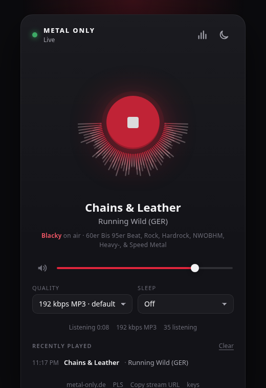

# webplayer

A small, dark web player for the [METAL ONLY](https://www.metal-only.de) stream.
Built to live in a RamBox tab. No dependencies, no build step.



## Run it

```sh
npm start                # http://127.0.0.1:8420
PORT=9000 npm start      # pick another port
npm test
```

Environment:

| Variable  | Default                                          | Meaning                       |
| --------- | ------------------------------------------------ | ----------------------------- |
| `PORT`    | `8420`                                           | Port to listen on             |
| `HOST`    | `127.0.0.1`                                      | Bind address (`0.0.0.0` for LAN) |
| `PLS_URL` | `https://metal-only.streampanel.cloud/listen.pls` | Playlist to read streams from |

## Run it as a service

```sh
scripts/install-service.sh          # picks the first free port from 8420 up
scripts/install-service.sh 9000     # or choose one
scripts/uninstall-service.sh
```

The install script writes a systemd user unit to `~/.config/systemd/user/webplayer.service`,
enables it and starts it. It restarts on failure and comes back after reboot.
Check on it with:

```sh
systemctl --user status webplayer
journalctl --user -u webplayer -f
```

## What the server does

- Serves the player from `public/`.
- `GET /api/streams` reads the PLS file, upgrades the URLs to HTTPS and merges in the
  other quality mounts the station advertises in its status JSON.
- `GET /api/now` returns the current track parsed into artist, song, DJ and show name.
- `GET /api/health` for a liveness check.

Audio goes straight from the browser to the station. The server only hands out
URLs and metadata.

## Player features

- Play / stop that always rejoins the live edge.
- Volume with a perceptual curve, mute, both remembered.
- Quality picker: 320 kbps AAC, 192 kbps MP3, 64 kbps AAC.
- Now playing with DJ and show, plus a history of recent tracks.
- Spectrum ring around the play button: log-spaced bands, fast attack and slow release, bass-driven glow (toggle with `v`).
- Sleep timer with a slow fade-out.
- Auto-reconnect with backoff, and a switch to the backup servers if one host dies.
- OS media keys and lock-screen info through the Media Session API.
- Theme toggle: dark, light, or follow the system (`t`).
- Keyboard: `Space` play/stop, `M` mute, arrows for volume.
